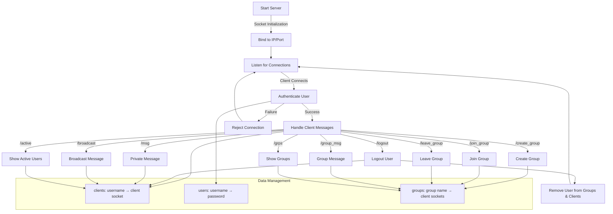

# Wazzapp: Simple Chat Server


## Overview

This project is part of the asignment submission for CS425 : Computer Networks. It implements a multi-threaded chat server that supports private messages, broadcast messages, group communication, and user authentication along with some extra utility and safety features.

The server is built using C++ and utilizes socket programming, multithreading, and data synchronization to handle multiple concurrent client connections. The use of mutexes ensures thread-safe access to shared data structures, preventing race conditions and ensuring data consistency. All commands and server/client status updates are printed on the server. **There are no server-side specific commands.**

## Requirements
- C++20 compiler
- POSIX-compliant operating system (e.g., Linux)

## Files

- `server_grp.cpp`: Server-side implementation.
- `client_grp.cpp`: Client-side implementation.
- `users.txt`: File containing test usernames and passwords.
- `Makefile`: Build script for compiling the server and client.
- `README.md`: This file.

## Setup


1. **Build the server and client:**
     ```sh 
     make
     ```
    
2. **Run the server**
    ```sh
    ./server_grp
    ```

3. **Run the client**
   ```sh
   ./client_grp
   ```


## Features Brief

### Basic Server Functionality

- A TCP based server listening to a specific port previously specified. (By default its 12345)

```
Server is listening for incoming clients on port number 12345...

```
- Ability to accept multiple concurrent client connections.


- Maintains list of clients connected with usernames
``` 
24: unordered_map<string, int>clients; //unordered map, username > client socket
```

- A new command ```/grps``` lists all groups and their members.

- A new command ```/active``` lists all active users.

```sh
/active
- alice (Socket: 6)
- frank (Socket: 5)
- bob (Socket: 4)

/grps
- cs425
  * bob (Socket: 4)
  * frank (Socket: 5)
``` 

- After successful client login, the user can log out of the session and use the same socket to log in with a different username.

```sh
/logout
Welcome to Wazzapp

Enter the username: 

```
### User Authentication

- The `users.txt` file contains test usernames and passwords in the format username:password. The server uses this file to authenticate clients. Example of `users.txt`:

```sh
alice:password123
bob:qwerty456
charlie:secure789
david:helloWorld!
eve:trustno1
frank:letmein
grace:passw0rd
```
 

- The client upon connecting to the server is prompted by an authentication process, asking for the username and password.Successful entry into the server will look like:

```sh
Connected to the server
Welcome to Wazzapp

Enter username: alice
Enter password: password123
Welcome to the chat server!

To broadcast the message to all online users type /broadcast <message>
To send message to a specific online client type /msg <username> <message>
To send message to a specific group type /group_msg <group_name> <message>
To create a new group type /create group <group name>
To join an existing group type /join group <group name>
To leave a group type /leave group <group name>
To get a list of all active users type /active
To get a list of all groups type /grps

To log out type /logout

Type /exit for closing the session

Enjoy your time here!
```


- If the username and password do not exist in `users.txt`, the client will be re-promted with another attempt to log in instead of diconnecting the client. Only after 3 failed log in attempts will the client be disconnected. 

```sh
Connected to the server.
Welcome to Wazzapp

Enter the username: bob
Enter the password: bob

Authentication failed!

Welcome to Wazzapp

Enter the username: 

```

- If the user is already logged in via a client session, it is not possible for another session to start under the same username. 

```sh
Connected to the server.
Welcome to Wazzapp

Enter the username: alice
Client already connected! Log out from previous session to connect.
Welcome to Wazzapp

Enter the username: 

```
### Messaging Features
- Broadcast messages can be sent to all connected clients using `/broadcast <message>`

- Private messages can be sent using `/msg <username> <message> `

- Group messages can be sent using `/group_msg <group_name> <message>`.  Non-group members can't send or recieve messages.


### Group Management 
- `/create group <group name>` creates a new group. Users can easily see available groups with list of all active users using `/grps`. Using the `/create_group` command users can create new groups with themselves as the first member.

- `/join group <group name>` for joining an existing group. All members in that group are notified about the new user and the list of active users in that group is updated, visible to all users.

- `/leave group <group name>` to leave a group. If all members leave the group the group is deleted.


- Mapping between group names and their members is maintained.
```sh
unordered_map<string, unordered_set<int>>groups; //unordered map, group name > client socket
```
- Any client can create a group
- The server maintains the groups


### Commands supported

- ```/msg <username> <message>```: Send a private message to a user.

- ```/broadcast <message>```: Send a message to all users.

- ```/create_group <group_name>```: Create a new group.

- ```/join_group <group_name>```: Join an existing group.

- ```/leave_group <group_name>```: Leave a group.

- ```/group_msg <group_name> <message>```: Send a message to a group.

- ```/grps```: List all groups and their members.

- ```/active```: List all active users.

- ```/logout```: Logout from the server.

- ```/exit```: Close the client session.

## Design Decisions

### Threading Model
- **Decision:** Create a new thread for each client connection.
- **Reason:** Creating a new thread for each client connection allows the server to handle multiple clients concurrently. They also share the same memory space, which makes it easier to share data between threads using shared data structures. This is particularly useful for maintaining the list of connected clients and groups.

### Synchronization
- **Decision:** Use mutexes to protect shared data structures.
- **Reason:** Ensures thread-safe access to shared resources like the client list and group list, preventing race conditions and maintain data consistency in a multi-threaded environment.

### Authentication
- **Decision:** Allow multiple login attempts even after failed authentication detection.
- **Reason:** Mistakes in login attempts are common hence upto 3 attempts need to be given to the user for a more cutstomer-friendly design.
- **Decision:** Not allowing one credential pair to be used by multiple clients concurrently
- **Reason:** Allows the server to have control over and limit maximum possible clients that can be connected.
- **Decision:** Allowing log out feature for clients
- **Reason:** To improve ease of communication, clients should be able to log in with different credentials without closing a socket.

### Group Commuication
- **Decision:** Adding extra features to allow users to lookup active users and existing groups.
- **Reason:** Ease of server usage.
- **Decision:** Only connected clients/active users are allowed to be part of the group. Once the user has been disconnected or logs out they are no longer part of the group.
- **Reason:** To store inactive or disconnected clients, we need a group to username mapping separate from the specified data structures in the assignment. Hence it was considered out of the scope of the same.
- **Decision:** If the last group member leaves, the group is deleted. However if they are disconnected the empty group is not deleted.
- **Reason:** Accidental disconnections due to client outage might happen in which case the group should stay for the client to reconnect.
- **Decision:**  Non-group members can't send or recieve messages.
- **Reason:** Privacy.
### 

## Implementation
### High-Level Idea of Important Functions

- **`clientHandler(int clientSocket)`**: 
  - This function is responsible for handling all communication with a single client. It runs in a separate thread for each client connection.
  - It continuously listens for messages from the client, processes the received messages, and sends appropriate responses back to the client.
  - It also handles client authentication, command processing, and ensures the client is properly logged out when the connection is closed.

- **`process_message(const string& message, int client_socket, bool& logout_flag)`**: 
  - This function processes the commands sent by the client.
  - It parses the message to determine the command and its arguments.
  - Based on the command, it calls the appropriate function to handle the request (e.g., broadcasting a message, sending a private message, creating a group, etc.).
  - It sets the `logout_flag` to true if the client requests to log out.

- **`create_group(int sock, const string& group_name)`**: 
  - This function creates a new group with the specified name.
  - It locks the `client_mutex` to ensure thread-safe access to the `groups` data structure.
  - It checks if the group already exists and sends an error message to the client if it does.
  - If the group does not exist, it creates the group and adds the client as the first member.

- **`join_group(int sock, const string& group_name)`**: 
  - This function adds a client to an existing group.
  - It locks the `client_mutex` to ensure thread-safe access to the `groups` data structure.
  - It checks if the group exists and sends an error message to the client if it does not.
  - If the group exists, it adds the client to the group and notifies all group members about the new member.

- **`leave_group(int sock, const string& group_name)`**: 
  - This function removes a client from a group.
  - It locks the `client_mutex` to ensure thread-safe access to the `groups` data structure.
  - It checks if the group exists and sends an error message to the client if it does not.
  - If the group exists, it removes the client from the group and notifies all group members about the departure.
  - If the group becomes empty after the client leaves, it deletes the group.

- **`broadcast_message(int sock, const string& msg)`**: 
  - This function sends a message to all connected clients.
  - It locks the `client_mutex` to ensure thread-safe access to the `clients` data structure.
  - It iterates through all connected clients and sends the message to each one.

- **`client_message(int sock, const string& name, const string& msg)`**: 
  - This function sends a private message to a specific client.
  - It locks the `client_mutex` to ensure thread-safe access to the `clients` data structure.
  - It checks if the specified client is connected and sends the message if they are.
  - If the specified client is not connected, it sends an error message to the sender.

### Code Flow

1. **Server Initialization**:
   - The server socket is created and bound to a specific port (default is 12345).
   - The server starts listening for incoming client connections.

2. **Accepting Client Connections**:
   - The server enters a loop where it accepts new client connections.
   - For each new client connection, a new thread is created to handle the client using the `clientHandler` function.

3. **Client Authentication**:
   - The `clientHandler` function prompts the client for a username and password.
   - The credentials are checked against the `users` data structure.
   - If authentication is successful, the client is added to the `clients` data structure and a welcome message is sent.
   - If authentication fails, the client is given up to three attempts before being disconnected.

4. **Command Processing**:
   - The `clientHandler` function continuously listens for messages from the client.
   - Each message is passed to the `process_message` function for command processing.
   - The `process_message` function parses the command and calls the appropriate function to handle the request.

5. **Group Management**:
   - Clients can create, join, and leave groups using the `/create_group`, `/join_group`, and `/leave_group` commands.
   - The `create_group`, `join_group`, and `leave_group` functions handle these requests and update the `groups` data structure accordingly.

6. **Messaging**:
   - Clients can send broadcast messages using the `/broadcast` command.
   - Clients can send private messages using the `/msg` command.
   - Clients can send group messages using the `/group_msg` command.
   - The `broadcast_message`, `client_message`, and `group_message` functions handle these requests and send the messages to the appropriate recipients.

7. **Client Logout**:
   - Clients can log out using the `/logout` command.
   - The `clientHandler` function sets the `logout_flag` and removes the client from the `clients` data structure.
   - The client connection is closed and the thread handling the client terminates.

## Code Flow Diagram



## Testing
### Stress Testing
- Simulated multiple clients connecting and sending messages simultaneously to ensure the server handles concurrency.

- The following table provides a summary of four stress tests conducted with different maximum loads, where load can be increased by increasing number of users, and number of messages sent by each.

| Max msgs per client | Max threads per client | Total Clients | Messages Sent | Auth Success | Auth Failures | Errors | Avg Response Time (s) | Throughput (msg/sec) |
|-------------|-------------|--------------|--------------|--------------|--------------|--------|----------------------|----------------------|
| 20        | 5       | 7            | 234          | 21           | 0            | 33     | 0.0258               | 1.67                 |
| 50        | 10      | 7            | 1360         | 57           | 0            | 69     | 0.0125               | 3.89                 |
| 50        | 50      | 7            | 1394         | 58           | 0            | 349    | 0.0172               | 3.98                 |
| 200       | 50      | 7            | 20894        | 216          | 0            | 349    | 0.0034               | 14.92                |

#### Observations
- The number of messages sent increased significantly in the last test.
- Error count spiked in the third and fourth tests.
- Average response time decreased as message throughput increased, suggesting improved efficiency under load.
- Authentication failures were consistently zero across all tests.

This summary helps in analyzing system performance under varying loads.

### Correctness Testing
- Verified that clients can connect, authenticate, and send messages.
- Tested group creation, joining, and leaving functionalities.

## Restrictions

- **Max Clients:** Limited by system resources and thread capacity.
- **Max Groups:** Limited by system memory.
- **Max Group Members:** Limited by system memory.
- **Max Message Size:** 1024 bytes (defined by `BUFFER_SIZE`).

## Challenges

### Challenges

- **Concurrency Issues:** 
  - **Challenge:** Faced race conditions when multiple threads accessed shared data structures simultaneously.
  - **Solution:** Used mutexes to ensure thread-safe access to shared resources like the client list and group list, preventing race conditions and ensuring data consistency.

- **Authentication:** 
  - **Challenge:** Ensuring secure and reliable authentication while allowing multiple login attempts.
  - **Solution:** Implemented a mechanism to allow up to 3 login attempts before closing the client socket. This involved careful handling of user credentials and managing the state of each client connection.

- **Thread Management:** 
  - **Challenge:** Managing multiple threads efficiently without causing resource exhaustion or performance degradation.
  - **Solution:** Created a new thread for each client connection to handle communication concurrently. Used `std::thread` and `detach` to allow threads to run independently, ensuring that the server remains responsive and scalable.

- **Resource Management:**
  - **Challenge:** Ensuring that resources such as sockets and threads are properly managed and released.
  - **Solution:** Implemented proper cleanup mechanisms to close client sockets and remove clients from data structures when they disconnect or log out.

- **Error Handling:**
  - **Challenge:** Handling various error scenarios such as client disconnections, invalid commands, and network issues.
  - **Solution:** Added comprehensive error handling to manage different scenarios gracefully, ensuring that the server remains stable and continues to operate correctly.

- **Synchronization:**
  - **Challenge:** Ensuring that all shared data structures are accessed in a thread-safe manner.
  - **Solution:** Used `std::lock_guard` to lock mutexes when accessing or modifying shared data structures, ensuring that only one thread can access the data at a time.


- **Testing:**
  - **Challenge:** Testing the server under various conditions, including high load, network failures, and edge cases.
  - **Solution:** Conducted extensive testing, including unit tests, integration tests, and stress tests, to ensure the server's robustness and reliability. Simulated different network conditions and client behaviors to identify and fix potential issues.

- **User Management:**
  - **Challenge:** Managing user sessions and ensuring that users can log in, log out, and switch accounts seamlessly.
  - **Solution:** Implemented robust session management mechanisms to handle user authentication, session tracking, and account switching efficiently.


## Contribution of Each Member

The following table outlines the contributions of the three main members of the project:

| Contributor [Roll Number] | Features Implemented   | Code Contribution (%) | Documentation Contribution (%) | Testing & Debugging (%) |
|---------------------------|----------------------------------------------|-----|-----|-----|
| Ravija Chandel [210835]           | Authentication, Messaging (group_message, client_message, broadcast_message, process_message), Debugging | 30%  | 40%  | 40%  |
| Shaurya Singh [218070969]       | Group Management (create_group, join_group, leave_group, print_groups, print_clients), Server Optimization, Extra Features        | 50%  | 30%  | 25%  |
| Shraman Das [218070996]       | Client Connection (clientHandler), Stress Testing       | 20%  | 30%  | 35%  |

## Sources Referred
1. **Books:**  
- Computer Networking:  A Top Down Approach, 8th Edition
2. **Blogs/Articles/Videos:**
- [Creating a TCP Server in C++](https://www.youtube.com/watch?v=cNdlrbZSkyQ)
- [Creating a TCP Client in C++](https://www.youtube.com/watch?v=fmn-pRvNaho&t=1220s)

## Declaration

We have read the CSE department’s anti-cheating policy available at https://www.cse.iitk.ac.in/pages/AntiCheatingPolicy.html. We understand that plagiarism is a severe
offense. We have solved this assignment ourselves without indulging in any plagiarism.

## Feedback

- The assignment was challenging and provided a good learning experience.
- It would be helpful to have more detailed guidelines on error handling and edge cases.

