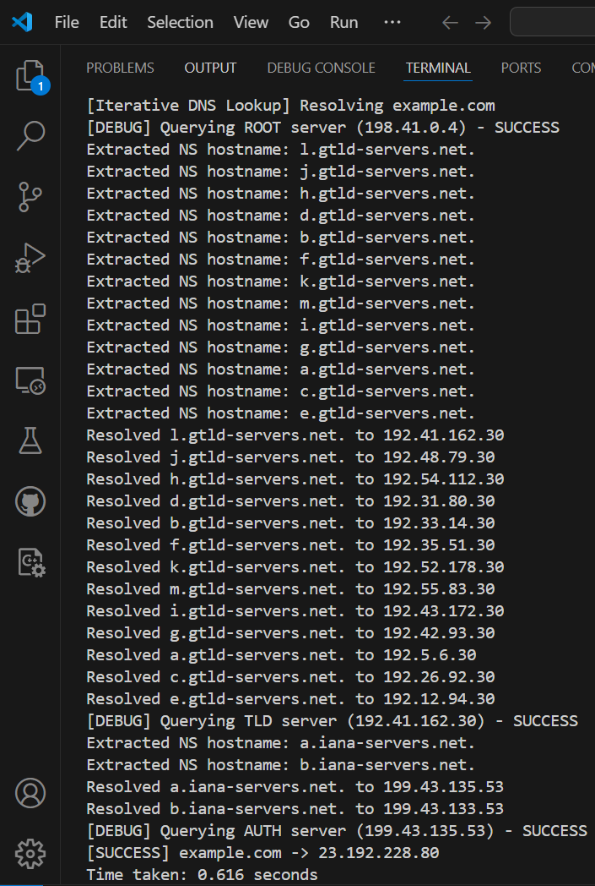

# DNS Query server

## Overview

This project is part of the asignment submission for CS425 : Computer Networks. It implements a DNS query server which can perform DNS query both iteratively and recursively. The server is built using python with error and exception handling at each stage.


## Error-Exception Handling
The following table includes all the error and exception blocks in each function along with the helper functions. 
| Function Name                | Exception Type                    | Handling Approach                                                   |
|------------------------------|----------------------------------|---------------------------------------------------------------------|
| `send_dns_query`             | `dns.exception.Timeout`          | Logs timeout error and retries with exponential backoff.            |
|                              | `dns.query.BadResponse`          | Logs bad response error and stops retrying.                         |
|                              | `Exception` (general)            | Logs unexpected error and stops retrying.                           |
| `extract_next_nameservers`   | `dns.resolver.NXDOMAIN`         | Logs warning for non-existent nameserver.                           |
|                              | `dns.resolver.NoAnswer`         | Logs warning for missing A record.                                  |
|                              | `dns.exception.Timeout`         | Logs timeout error while resolving NS.                              |
|                              | `Exception` (general)            | Logs unexpected resolution failure.                                 |
| `iterative_dns_lookup`       | -                                | Handles errors via `send_dns_query` and `extract_next_nameservers`. |
|                              | -                                | Stops resolution if no next nameservers are available.              |
| `recursive_dns_lookup`       | `dns.resolver.NXDOMAIN`         | Logs error for non-existent domain.                                 |
|                              | `dns.resolver.NoAnswer`         | Logs error if no A record is found.                                 |
|                              | `dns.resolver.Timeout`          | Logs timeout error.                                                 |
|                              | `Exception` (general)            | Logs unexpected lookup failure.                                     |
| `is_valid_domain`            | -                                | Uses regex validation; no explicit exception handling.              |
| `normalize_domain`           | `idna.IDNAError`                 | Returns `None` for invalid domain names.                           |
| `__main__`                   | `IndexError`                     | Validates CLI arguments and exits on invalid input.                 |
|                              | `SystemExit`                     | Exits the script on invalid input.                                  |

## Setup

1. **Start the DNS server**
    ```sh
    python dnsresolver.py 
    ```

2. **Perform iterative DNS query on example.com**
    ```sh
    python dnsresolver.py iterative example.com
    ```
    

3. **Perform recursive DNS query on example.com**
    ```sh
    python dnsresolver.py recursive example.com
    ```
    

## Examples

1. **Perform iterative DNS query on 'google.com'**
    
2. **Perform recursive DNS query on 'google.com'**
    
    

 

## 📊 **Code Flow Diagram**


## Observations
Recursive queries are much faster as compared to iterative DNS query due to the following reasons:
|                     **Iterative Query**                       |                     **Recursive Query**                       |
|---------------------------------------------------------------|---------------------------------------------------------------|
| The recursive resolver (like Google DNS 8.8.8.8, Cloudflare 1.1.1.1, or your ISP's resolver) does all the work| Your program starts at the root servers and queries each level of the hierarchy manually|
| You only send one request, and the resolver sends back the final answer| Each step requires a new network request, introducing extra latency|
| It queries the root servers, TLD servers, and authoritative servers with a single request| If any server is slow to respond, it delays the entire resolution process|
|These resolvers often cache responses, meaning that if someone recently queried the same domain, the answer is already stored and can be returned instantly without contacting external servers| Unlike recursive resolvers, your program does not cache previous responses, meaning every lookup is fresh|

Recursive queries are generally faster because they use caching and reduce network round trips. 
Iterative queries, on the other hand, give you more control but at the cost of increased latency.
Iterative query can be optimized by adding caching or parallel requests.

## Contributing

The following table outlines the contributions of the three main members of the project:

| Contributor [Roll Number] | Code Contribution (%) | Documentation Contribution (%) | Testing & Debugging (%) |
|---------------------------|-----|-----|-----|
| Ravija [210835]           | 36%  | 32%  | 32%  |
| Shaurya [218070969]       | 32%  | 32%  | 36%  |
| Shraman [218070996]       | 32%  | 36%  | 32%  |


Contributions are welcome! The repository will be public soon. Please fork the repository and submit a pull request. 

## References
- [RFC 1034 - Domain Names](https://tools.ietf.org/html/rfc1034)
- [Youtube - Make your own DNS Server](https://www.youtube.com/playlist?list=PLBOh8f9FoHHhvO5e5HF_6mYvtZegobYX2)
- [Youtube - Create Your Own Python DNS ENUMERATION TOOL](https://www.youtube.com/watch?v=SLQrbjeVrk0&t=1147s)
- [James F. Kurose, Keith W. Ross - Computer Networking, A Top Down Approach](https://gaia.cs.umass.edu/kurose_ross/eighth.php)