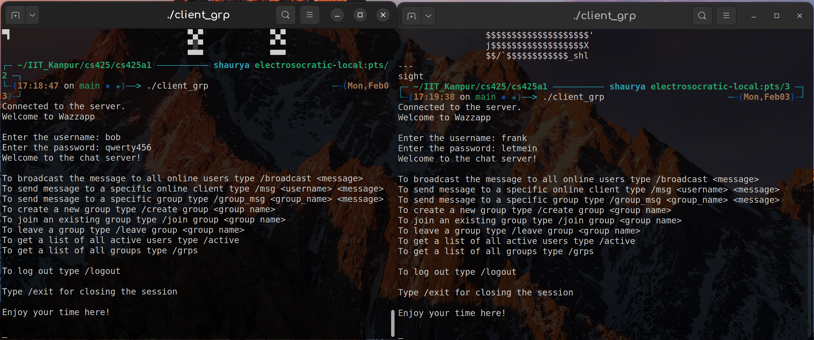
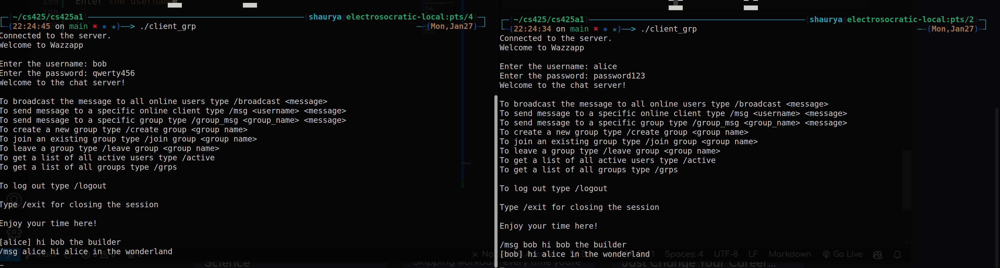

# Wazzapp: Simple Chat Server


## Overview

This project is part of the asignment submission for CS425 : Computer Networks. It implements a multi-threaded chat server that supports private messages, broadcast messages, group communication, and user authentication along with some extra utility and safety features.

The server is built using C++ and utilizes socket programming, multithreading, and data synchronization to handle multiple concurrent client connections. The use of mutexes ensures thread-safe access to shared data structures, preventing race conditions and ensuring data consistency. All commands and server/client status updates are printed on the server. **There are no server-side specific commands.**

## Requirements
- C++20 compiler
- POSIX-compliant operating system (e.g., Linux)

## Files

- `server_grp.cpp`: Server-side implementation.
- `client_grp.cpp`: Client-side implementation.
- `users.txt`: File containing test usernames and passwords.
- `Makefile`: Build script for compiling the server and client.
- `README.md`: This file.

## Setup


1. **Build the server and client:**
     ```sh 
     make
     ```
    
2. **Run the server**
    ```sh
    ./server_grp
    ```

3. **Run the client**
   ```sh
   ./client_grp
   ```

<!-- ## Features 
1. **Client Connection:**
   - Authentication with username and password.
   - Prevents multiple connections with the same username.
   - Logout functionality.

2. **Messaging:**
   - Broadcast messages to all connected clients.
   - Send private messages to specific users.
   - Send messages to group members.

3. **Group Management:**
   - Create new groups.
   - Join existing groups.
   - Leave groups.

4. **Statistics:**
   - List all active users with socket numbers
   - List all groups and their members with socket numbers -->

## Features Brief

### Basic Server Functionality

- A TCP based server listening to a specific port previously specified. (By default its 12345)

```
Server is listening for incoming clients on port number 12345...

```
- Ability to accept multiple concurrent client connections.



- Maintains list of clients connected with usernames
``` 
24: unordered_map<string, int>clients; //unordered map, username > client socket
```

- A new command ```/grps``` lists all groups and their members.

- A new command ```/active``` lists all active users.

```sh
/active
- alice (Socket: 6)
- frank (Socket: 5)
- bob (Socket: 4)

/grps
- cs425
  * bob (Socket: 4)
  * frank (Socket: 5)
``` 

- After successful client login, the user can log out of the session and use the same socket to log in with a different username.

```sh
/logout
Welcome to Wazzapp

Enter the username: 

```
### User Authentication

- The `users.txt` file contains test usernames and passwords in the format username:password. The server uses this file to authenticate clients. Example of `users.txt`:

```sh
alice:password123
bob:qwerty456
charlie:secure789
david:helloWorld!
eve:trustno1
frank:letmein
grace:passw0rd
```
 

- The client upon connecting to the server is prompted by an authentication process, asking for the username and password.Successful entry into the server will look like:

```sh
Connected to the server
Welcome to Wazzapp

Enter username: alice
Enter password: password123
Welcome to the chat server!

To broadcast the message to all online users type /broadcast <message>
To send message to a specific online client type /msg <username> <message>
To send message to a specific group type /group_msg <group_name> <message>
To create a new group type /create group <group name>
To join an existing group type /join group <group name>
To leave a group type /leave group <group name>
To get a list of all active users type /active
To get a list of all groups type /grps

To log out type /logout

Type /exit for closing the session

Enjoy your time here!
```


- If the username and password do not exist in `users.txt`, the client will be re-promted with another attempt to log in instead of diconnecting the client. Only after 3 failed log in attempts will the client be disconnected. 

```sh
Connected to the server.
Welcome to Wazzapp

Enter the username: bob
Enter the password: bob

Authentication failed!

Welcome to Wazzapp

Enter the username: 

```

- If the user is already logged in via a client session, it is not possible for another session to start under the same username. 

```sh
Connected to the server.
Welcome to Wazzapp

Enter the username: alice
Client already connected! Log out from previous session to connect.
Welcome to Wazzapp

Enter the username: 

```
### Messaging Features
- Broadcast messages can be sent to all connected clients using `/broadcast <message>`

- Private messages can be sent using `/msg <username> <message> `

- Group messages can be sent using `/group_msg <group_name> <message>`.  Non-group members can't send or recieve messages.


### Group Management 
- `/create group <group name>` creates a new group. Users can easily see available groups with list of all active users using `/grps`. Using the `/create_group` command users can create new groups with themselves as the first member.

- `/join group <group name>` for joining an existing group. All members in that group are notified about the new user and the list of active users in that group is updated, visible to all users.

- `/leave group <group name>` to leave a group. If all members leave the group the group is deleted.


- Mapping between group names and their members is maintained.
```sh
unordered_map<string, unordered_set<int>>groups; //unordered map, group name > client socket
```
- Any client can create a group
- The server maintains the groups


### Commands supported

- ```/msg <username> <message>```: Send a private message to a user.

- ```/broadcast <message>```: Send a message to all users.

- ```/create_group <group_name>```: Create a new group.

- ```/join_group <group_name>```: Join an existing group.

- ```/leave_group <group_name>```: Leave a group.

- ```/group_msg <group_name> <message>```: Send a message to a group.

- ```/grps```: List all groups and their members.

- ```/active```: List all active users.

- ```/logout```: Logout from the server.

- ```/exit```: Close the client session.

## Design Decisions

### Threading Model
- **Decision:** Create a new thread for each client connection.
- **Reason:** This allows the server to handle multiple clients concurrently without blocking on any single client.

### Synchronization
- **Decision:** Use mutexes to protect shared data structures.
- **Reason:** Ensures thread-safe access to shared resources like the client list and group list, preventing race conditions.

### Authentication
- **Decision:** Allow multiple login attempts even after failed authentication detection.
- **Reason:** Mistakes in login attempts are common hence upto 3 attempts need to be given to the user for a more cutstomer-friendly design.
- **Decision:** Not allowing one credential pair to be used by multiple clients concurrently
- **Reason:** Allows the server to have control over and limit maximum possible clients that can be connected.
- **Decision:** Allowing log out feature for clients
- **Reason:** To improve ease of communication, clients should be able to log in with different credentials without closing a socket.

### Group Commuication
- **Decision:** Adding extra features to allow users to lookup active users and existing groups.
- **Reason:** Ease of server usage.
- **Decision:** Only connected clients/active users are allowed to be part of the group. Once the user has been disconnected or logs out they are no longer part of the group.
- **Reason:** To store inactive or disconnected clients, we need a group to username mapping separate from the specified data structures in the assignment. Hence it was considered out of the scope of the same.
- **Decision:** If the last group member leaves, the group is deleted. However if they are disconnected the empty group is not deleted.
- **Reason:** Accidental disconnections due to client outage might happen in which case the group should stay for the client to reconnect.
- **Decision:**  Non-group members can't send or recieve messages.
- **Reason:** Privacy.
### 


### High-Level Idea of Important Functions
- **`clientHandler(int clientSocket)`**: Handles communication with a single client.
- **`process_message(const string& message, int client_socket, bool& logout_flag)`**: Processes commands sent by the client.
- **`create_group(int sock, const string& group_name)`**: Creates a new group.
- **`join_group(int sock, const string& group_name)`**: Adds a client to an existing group.
- **`leave_group(int sock, const string& group_name)`**: Removes a client from a group.
- **`broadcast_message(int sock, const string& msg)`**: Sends a message to all clients.
- **`client_message(int sock, const string& name, const string& msg)`**: Sends a private message to a specific client.

### Code Flow


## Testing

### Correctness Testing
- Verified that clients can connect, authenticate, and send messages.
- Tested group creation, joining, and leaving functionalities.

### Stress Testing
- Simulated multiple clients connecting and sending messages simultaneously to ensure the server handles concurrency.

## Restrictions

- **Max Clients:** Limited by system resources and thread capacity.
- **Max Groups:** Limited by system memory.
- **Max Group Members:** Limited by system memory.
- **Max Message Size:** 1024 bytes (defined by `BUFFER_SIZE`).

## Challenges

- **Concurrency Issues:** Faced race conditions which were resolved by using mutexes.
- **Authentication:** Ensuring secure and reliable authentication was challenging.
- **Thread Management:** Managing multiple threads efficiently without causing resource exhaustion.


## Contribution of Each Member

- **Ravija Chandel (210835)** 
- **Shaurya Singh (218070969)** 
- **Shraman Das ()** 

## Sources Referred

- "Beej's Guide to Network Programming"
- C++ reference documentation
- Various online tutorials on socket programming and multithreading

## Declaration

We declare that we did not indulge in plagiarism and the work submitted is our own.

## Feedback

- The assignment was challenging and provided a good learning experience.
- It would be helpful to have more detailed guidelines on error handling and edge cases.

## Contributing
Contributions are welcome! The repository will be public soon. Please fork the repository and submit a pull request. 
